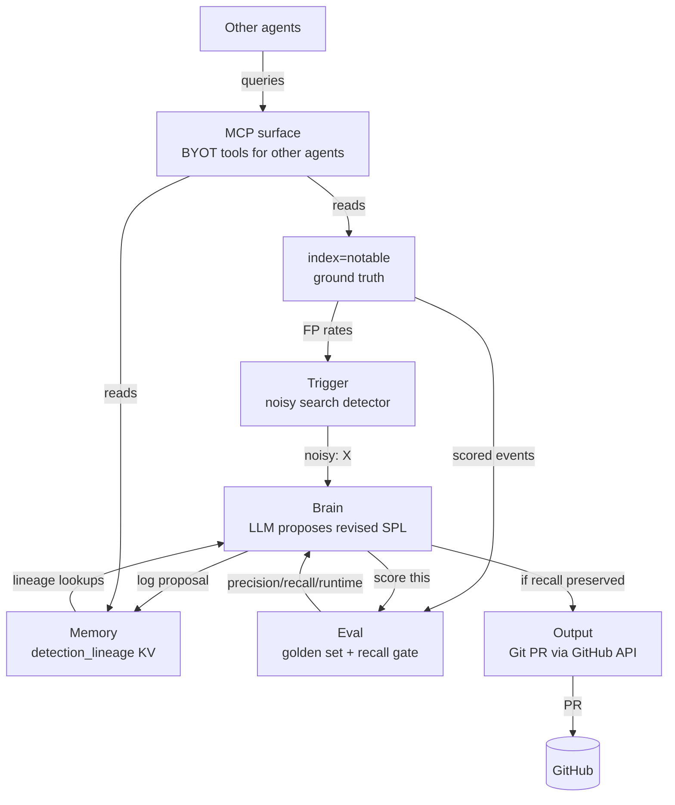

# Squelch Architecture

Squelch is an automated detection-tuning loop for Splunk: it watches for noisy correlation searches, asks an LLM to propose a fix, validates the fix against a golden dataset, and (eventually) ships the change as a Git PR.

## System diagram (ASCII)

```
              +-----------------------------------+
              |   index=notable (ground truth)    |
              +-----------------------------------+
                 |                          ^
                 | FP rates                 | scored events
                 v                          |
        +----------------+          +----------------+
        |    Trigger     |          |      Eval      |
        | (noisy search  |          | (golden set,   |
        |  detector)     |          |  recall gate)  |
        +----------------+          +----------------+
                 |                       ^      |
       "noisy: X"|                 score |      | precision/
                 v                 this  |      | recall/runtime
        +----------------+          +----------------+
        |     Brain      |--------->|     (Eval)     |
        | (LLM proposes  |<---------|                |
        |  revised SPL)  | result   +----------------+
        +----------------+
            |        |
   log      |        | if recall preserved
   proposal v        v
        +----------------+          +----------------+
        |    Memory      |          |    Output      |
        | (detection_    |          | (Git PR via    |
        |  lineage KV)   |          |  GitHub API)   |
        +----------------+          +----------------+
                 ^
                 | lineage lookups
                 |
        +----------------+
        | MCP surface    |  <--- other agents (BYOT tools)
        | (mcp_tools KV) |       also reads index=notable
        +----------------+
```

## System diagram (Mermaid)



## The six boxes

### 1. Trigger

Periodically queries `index=notable` to find correlation searches whose false-positive rate exceeds a threshold, then emits a "this detection is noisy" signal to the Brain. The synthetic ground-truth data is seeded by [seed_notable.py](../scripts/seed_notable.py) (✓ built), and the FP-rate computation lives in [eval_lib.py](../eval/eval_lib.py) (✓ built). The periodic scheduler that polls and fires the Brain is Phase 8 (✗ not started) — for now, invocations are manual via the CLI / custom command.

### 2. Brain

Calls an LLM to propose a revised SPL for a noisy detection. Two outbound paths are proven end-to-end: (a) the in-SPL `| ai prompt="..."` command backed by Gemini 2.5 Flash through the `aitk_llm_connection` KV config (✓ proven), and (b) outbound HTTPS from inside the custom command via `| squelch mode="llm_probe"`, implemented as the `_llm_probe` method in [squelch_command.py](../../../Applications/Splunk/etc/apps/squelch/bin/squelch_command.py) (✓ proven). The actual prompting strategy, clustering of similar FPs, and proposal-generation logic are Phase 8 (✗ not started).

### 3. Memory

KV store collection `detection_lineage` that persists, per detection, the SPL revision history, FP-rate trajectory over time, and the lineage of why each tuning was applied. The collection schema is defined in [collections.conf](../../../Applications/Splunk/etc/apps/squelch/default/collections.conf) (✓ built). Writes from the Brain (logging proposals) and reads on subsequent invocations (lineage-aware prompting) are Phase 8 (✗ not started).

### 4. Eval

Runs a proposed SPL against the golden dataset and returns precision, recall, and runtime. A recall-preservation gate is mandatory: any tuning that drops recall below the baseline is rejected before it can reach Output, no matter how much it improves precision. Implemented in [eval_lib.py](../eval/eval_lib.py) — exposed both as a CLI and as `| squelch mode="validate"` — against [golden_dataset.conf](../eval/golden_dataset.conf), with baseline numbers checked in at [baseline_evals.csv](../eval/results/baseline_evals.csv) (✓ built).

### 5. MCP surface

Squelch exposes data-collection tools (e.g. `squelch_fp_rates_by_search`) to other agents through Splunk_MCP_Server's BYOT (bring-your-own-tools) mechanism. This lets a peer agent ask "which detections are noisy right now?" without itself knowing anything about Splunk or SPL. Tools are registered by writing to the `mcp_tools` and `mcp_tools_enabled` KV collections, and the end-to-end path is proven with one registered tool (✓ proven). Reads flow from `index=notable` and from `detection_lineage` (the Memory box) on behalf of the calling agent.

### 6. Output (Phase 8 stub)

Eventually opens a Git pull request containing the proposed SPL revision via the GitHub API, so a human reviewer is the final gate before production. Status: ✗ not started. The outbound-HTTPS plumbing it needs is already proven (Bundle 0 SDK T5 and the Bundle 1 `llm_probe` work both established that the custom command can reach external HTTPS endpoints), so the remaining work is GitHub-specific: auth, repo layout convention, and PR body formatting.

## Data flow summary

- `index=notable` is the synthetic ground truth, read by both Trigger and Eval, and seeded by [seed_notable.py](../scripts/seed_notable.py).
- Trigger → Brain: "this detection is noisy, propose a fix"
- Brain → Memory: "log the proposal"
- Brain → Eval: "score this proposal"
- Eval → Brain: precision / recall / runtime (recall-preservation gate enforced here)
- If Eval passes: Brain → Output → Git PR
- Memory is consulted by all subsequent Brain invocations (lineage-aware tuning)
- MCP surface reads from `index=notable` and `detection_lineage` on behalf of external agents

## See also

- [platform-shape.md](./platform-shape.md) — what Splunk gives us to build on
- [direction-lock.md](./direction-lock.md) — why these six boxes and not others
